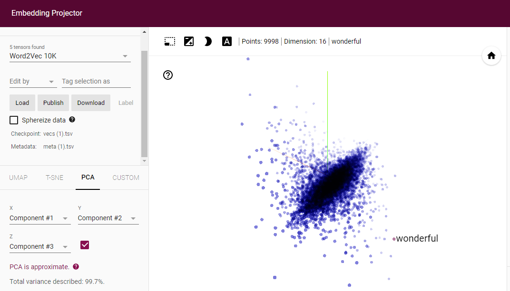

## Visualizing Data using the Embedding Projector in TensorBoard

Using the TensorBoard Embedding Projector, you can graphically represent high dimensional embeddings. This can be helpful in visualizing, examining, and understanding your embedding layers.

The Tensorflow embedding projector can be found [here](https://projector.tensorflow.org/).

Steps :
upload both meta.tsv and vecs.tsv files to visualizing data.

